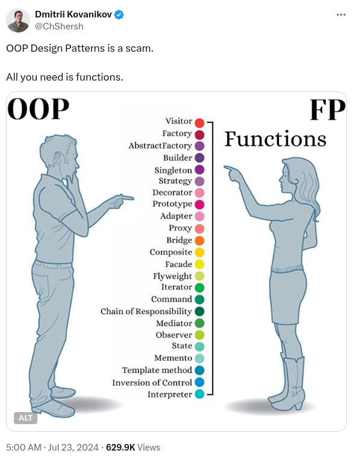
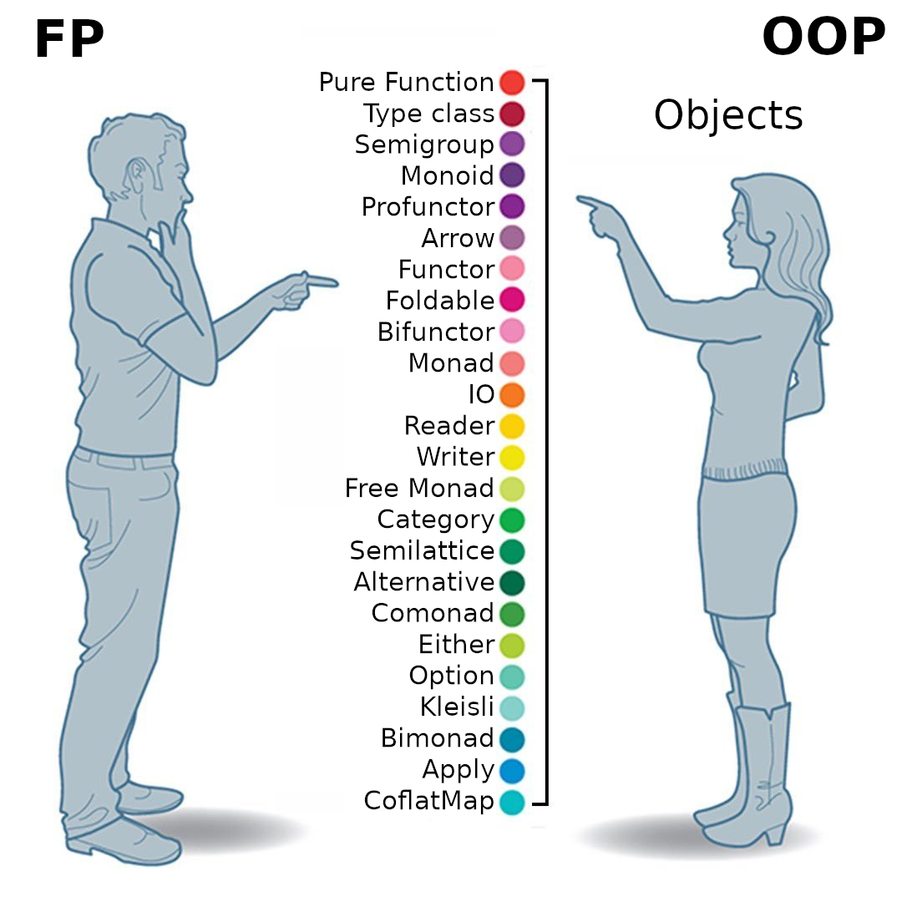
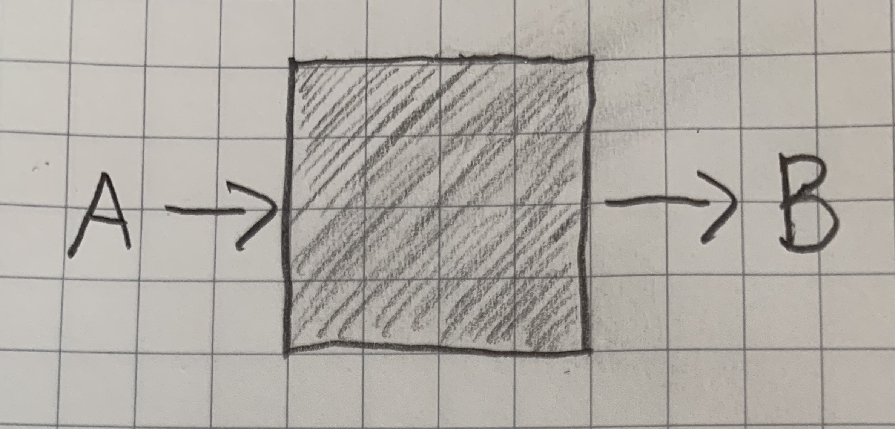
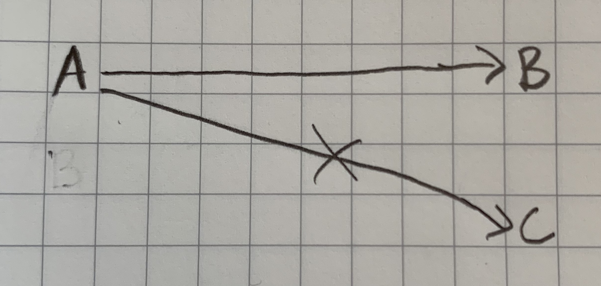
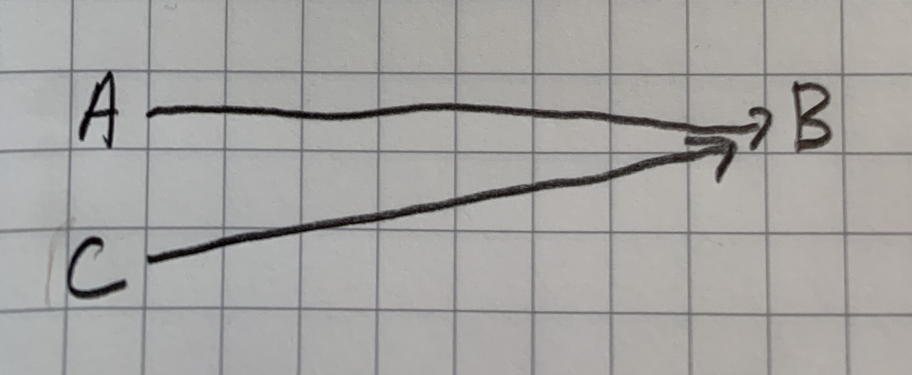
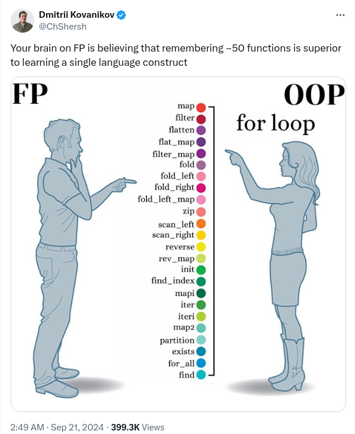

## What The Functional Programming

#### James Ward
*Developer Advocate @ AWS*
<a href="https://twitter.com/_JamesWard" class="twitter-follow-button" data-size="large">@_JamesWard</a><script async src="https://platform.twitter.com/widgets.js" charset="utf-8"></script>

---



---

> If you can use math to do something, you should

*Philip Wadler*

---



---

## Immutability

@[code lang=scala transclude={9-11}](@/../src/main/scala/Immutability.scala)

---

## Expression-Oriented

@[code lang=scala transclude={7-12}](@/../src/main/scala/ExpressionOriented.scala)

---

## Pure Functions

* Takes inputs and return outputs
    
* Consistent mapping from inputs to outputs
    
    

---

## Function Composition

@[code lang=scala transclude={10-11}](@/../src/main/scala/FunctionComposition.scala)

---

## Higher-Order Functions

@[code lang=scala transclude=5](@/../src/main/scala/HigherOrderFunctions.scala)
@[code lang=scala transclude=13](@/../src/main/scala/HigherOrderFunctions.scala)

---



---

## Monads

> The curse of the Monad: Once you understand Monads, you lose the ability to explain it to anyone else

*Douglas Crawford*

---

## Make Illegal States Unrepresentable

> Making illegal states unrepresentable is a way of statically proving that all runtime values correspond to valid objects in the business domain.

*Yuriy Bogomolov*
[ybogomolov.me/making-illegal-states-unrepresentable](https://ybogomolov.me/making-illegal-states-unrepresentable)

---

## ADTs & Pattern Matching

* Type Composition: Types with Operators
* Operators have properties: `a+b=b+a`
* Quiz: When did they first appear?

---

## Polymorphism: Reuse via Single Symbol for Multiple Types

* Ad-Hoc: Overloading
* Subtyping: Inheritance
* Parametric: Generics

---

## Type Classes: Inversion of Ad-Hoc Polymorphism

* Typical Overloading
    ```scala
    fun doit(i: Int) = s"number = $i"
    fun doit(s: String) = s"str = $s"
    
    val o1 = doit(1)
    val o1 = doit("asdf")
    ```

* Inverted
    ```scala
    1.doit()
    "asdf".doit()    
    ```
* Nesting
    ```scala
    case class Foo(i: Int, s: String)
    Foo(1, "asdf").doit()
    ```

---

## Applicatives

* Functors: 1:1 transform
* Monads: m:1 binary tree
* Applicatives: m:s|s transform
* Uses: parsers, validators, error accumulators

---

## Effects

> "A system of only pure functions, does nothing useful"

---

## Where to next?

* Slides: [jamesward.com/presos](https://www.jamesward.com/presos">jamesward.com/presos)
* ZIO: [zio.dev](https://zio.dev)
* Kotlin FP: [arrow-kt-io](https://arrow-kt.io/)
