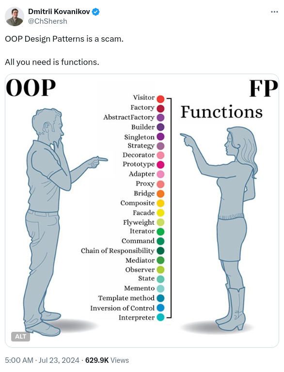
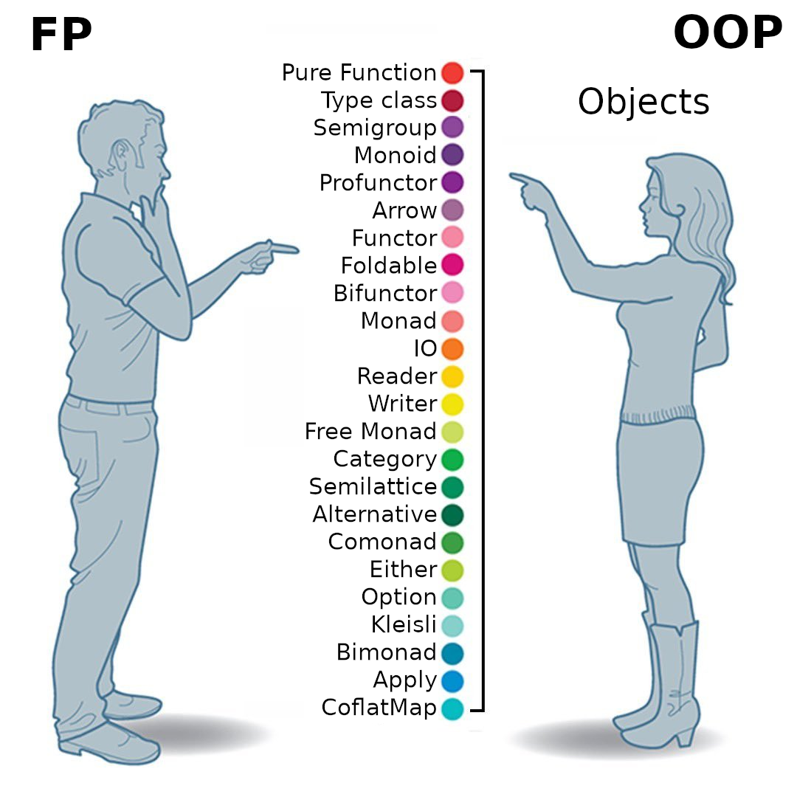
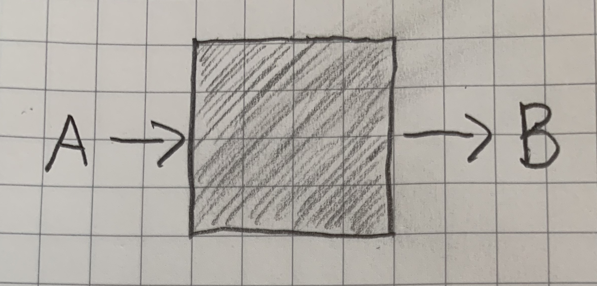
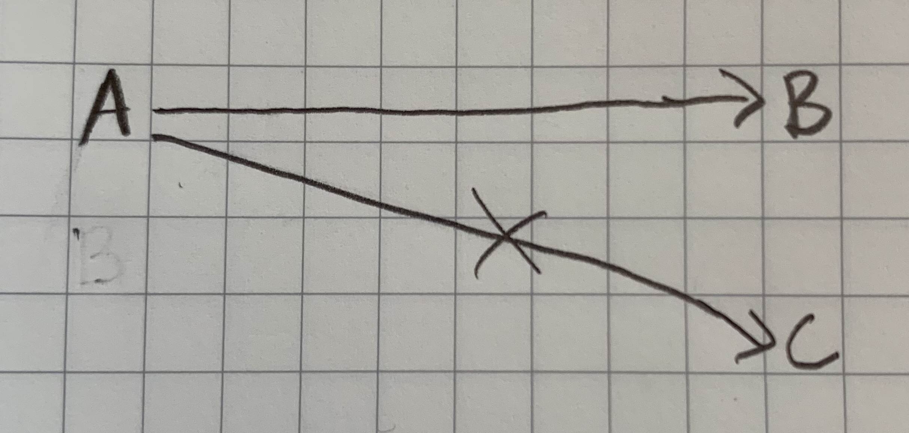
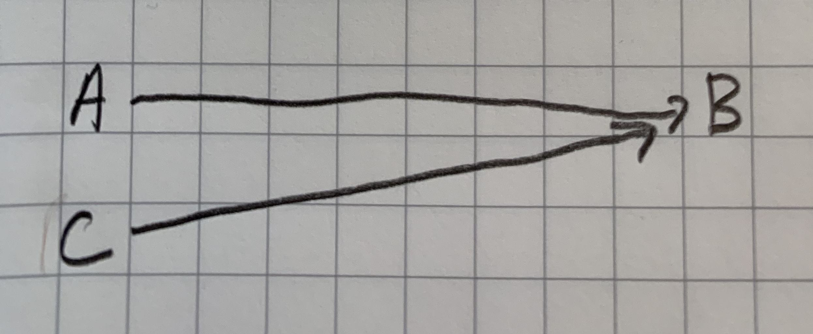
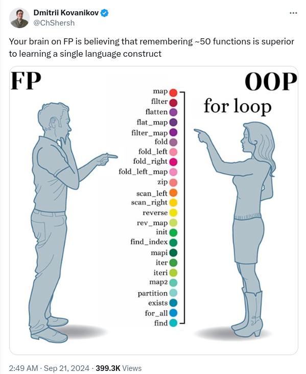

## What The Functional Programming

#### James Ward
*Developer Advocate @ AWS*
[](https://x.com/JamesWard) [](https://bsky.app/profile/jamesward.com) [](https://linkedin.com/in/jamesward)

[](https://community.aws/content/2v8AETAkyvPp9RVKC4YChncaEbs/running-mcp-based-agents-clients-servers-on-aws?trk=45f224da-19c1-40f7-89dd-2bd099f3fad9&sc_channel=3Pevent)

---



---

> If you can use math to do something, you should

*Philip Wadler*

---



---

<svg viewBox="0 0 800 600" xmlns="http://www.w3.org/2000/svg">
  <!-- Background -->
  <rect width="800" height="600" fill="#f8f9fa"/>
  
  <!-- Title -->
  <text x="400" y="50" font-family="Arial" font-size="24" font-weight="bold" text-anchor="middle">Java Functional Programming Features Timeline</text>
  
  <!-- Timeline line -->
  <line x1="100" y1="150" x2="700" y2="150" stroke="#333" stroke-width="4"/>
  
  <!-- Year markers -->
  <line x1="100" y1="150" x2="100" y2="160" stroke="#333" stroke-width="2"/>
  <text x="100" y="180" font-family="Arial" font-size="14" text-anchor="middle">2014</text>
  
  <line x1="220" y1="150" x2="220" y2="160" stroke="#333" stroke-width="2"/>
  <text x="220" y="180" font-family="Arial" font-size="14" text-anchor="middle">2016</text>
  
  <line x1="340" y1="150" x2="340" y2="160" stroke="#333" stroke-width="2"/>
  <text x="340" y="180" font-family="Arial" font-size="14" text-anchor="middle">2018</text>
  
  <line x1="460" y1="150" x2="460" y2="160" stroke="#333" stroke-width="2"/>
  <text x="460" y="180" font-family="Arial" font-size="14" text-anchor="middle">2020</text>
  
  <line x1="580" y1="150" x2="580" y2="160" stroke="#333" stroke-width="2"/>
  <text x="580" y="180" font-family="Arial" font-size="14" text-anchor="middle">2022</text>
  
  <line x1="700" y1="150" x2="700" y2="160" stroke="#333" stroke-width="2"/>
  <text x="700" y="180" font-family="Arial" font-size="14" text-anchor="middle">2024</text>
  
  <!-- Java 8 (2014) -->
  <circle cx="100" cy="150" r="10" fill="#f89c0e"/>
  <line x1="100" y1="150" x2="100" y2="250" stroke="#f89c0e" stroke-width="2" stroke-dasharray="5,3"/>
  <rect x="20" y="250" width="160" height="120" rx="10" fill="#f89c0e" fill-opacity="0.2" stroke="#f89c0e" stroke-width="2"/>
  <text x="100" y="270" font-family="Arial" font-size="16" font-weight="bold" text-anchor="middle">Java 8 (March 2014)</text>
  <text x="100" y="295" font-family="Arial" font-size="14" text-anchor="middle">• Lambda Expressions</text>
  <text x="100" y="315" font-family="Arial" font-size="14" text-anchor="middle">• Functional Interfaces</text>
  <text x="100" y="335" font-family="Arial" font-size="14" text-anchor="middle">• Stream API</text>
  <text x="100" y="355" font-family="Arial" font-size="14" text-anchor="middle">• Method References</text>
  
  <!-- Java 9 (2017) -->
  <circle cx="260" cy="150" r="10" fill="#4285f4"/>
  <line x1="260" y1="150" x2="260" y2="210" stroke="#4285f4" stroke-width="2" stroke-dasharray="5,3"/>
  <rect x="180" y="210" width="160" height="80" rx="10" fill="#4285f4" fill-opacity="0.2" stroke="#4285f4" stroke-width="2"/>
  <text x="260" y="230" font-family="Arial" font-size="16" font-weight="bold" text-anchor="middle">Java 9 (Sept 2017)</text>
  <text x="260" y="255" font-family="Arial" font-size="14" text-anchor="middle">• Factory Methods for</text>
  <text x="260" y="275" font-family="Arial" font-size="14" text-anchor="middle">  Immutable Collections</text>
  
  <!-- Java 10 (2018) -->
  <circle cx="340" cy="150" r="10" fill="#0f9d58"/>
  <line x1="340" y1="150" x2="340" y2="320" stroke="#0f9d58" stroke-width="2" stroke-dasharray="5,3"/>
  <rect x="260" y="320" width="160" height="50" rx="10" fill="#0f9d58" fill-opacity="0.2" stroke="#0f9d58" stroke-width="2"/>
  <text x="340" y="340" font-family="Arial" font-size="16" font-weight="bold" text-anchor="middle">Java 10 (March 2018)</text>
  <text x="340" y="360" font-family="Arial" font-size="14" text-anchor="middle">• Local Variable Type Inference</text>
  
  <!-- Java 11 (2018) -->
  <circle cx="380" cy="150" r="10" fill="#db4437"/>
  <line x1="380" y1="150" x2="380" y2="250" stroke="#db4437" stroke-width="2" stroke-dasharray="5,3"/>
  <rect x="300" y="400" width="160" height="70" rx="10" fill="#db4437" fill-opacity="0.2" stroke="#db4437" stroke-width="2"/>
  <text x="380" y="420" font-family="Arial" font-size="16" font-weight="bold" text-anchor="middle">Java 11 (Sept 2018)</text>
  <text x="380" y="445" font-family="Arial" font-size="14" text-anchor="middle">• New String Methods</text>
  <text x="380" y="465" font-family="Arial" font-size="14" text-anchor="middle">• Collection.toArray(IntFunction)</text>
  
  <!-- Java 14 (2020) -->
  <circle cx="460" cy="150" r="10" fill="#744da9"/>
  <line x1="460" y1="150" x2="460" y2="210" stroke="#744da9" stroke-width="2" stroke-dasharray="5,3"/>
  <rect x="380" y="210" width="160" height="80" rx="10" fill="#744da9" fill-opacity="0.2" stroke="#744da9" stroke-width="2"/>
  <text x="460" y="230" font-family="Arial" font-size="16" font-weight="bold" text-anchor="middle">Java 14 (March 2020)</text>
  <text x="460" y="255" font-family="Arial" font-size="14" text-anchor="middle">• Switch Expressions</text>
  <text x="460" y="275" font-family="Arial" font-size="14" text-anchor="middle">  (Standard Feature)</text>
  
  <!-- Java 15 (2020) -->
  <circle cx="500" cy="150" r="10" fill="#1a73e8"/>
  <line x1="500" y1="150" x2="500" y2="380" stroke="#1a73e8" stroke-width="2" stroke-dasharray="5,3"/>
  <rect x="420" y="380" width="160" height="50" rx="10" fill="#1a73e8" fill-opacity="0.2" stroke="#1a73e8" stroke-width="2"/>
  <text x="500" y="400" font-family="Arial" font-size="16" font-weight="bold" text-anchor="middle">Java 15 (Sept 2020)</text>
  <text x="500" y="420" font-family="Arial" font-size="14" text-anchor="middle">• Text Blocks</text>
  
  <!-- Java 16 (2021) -->
  <circle cx="540" cy="150" r="10" fill="#ea4335"/>
  <line x1="540" y1="150" x2="540" y2="250" stroke="#ea4335" stroke-width="2" stroke-dasharray="5,3"/>
  <rect x="460" y="450" width="160" height="70" rx="10" fill="#ea4335" fill-opacity="0.2" stroke="#ea4335" stroke-width="2"/>
  <text x="540" y="470" font-family="Arial" font-size="16" font-weight="bold" text-anchor="middle">Java 16 (March 2021)</text>
  <text x="540" y="495" font-family="Arial" font-size="14" text-anchor="middle">• Records</text>
  <text x="540" y="515" font-family="Arial" font-size="14" text-anchor="middle">• Pattern Matching for instanceof</text>
  
  <!-- Java 17 (2021) -->
  <circle cx="580" cy="150" r="10" fill="#34a853"/>
  <line x1="580" y1="150" x2="580" y2="290" stroke="#34a853" stroke-width="2" stroke-dasharray="5,3"/>
  <rect x="500" y="290" width="160" height="60" rx="10" fill="#34a853" fill-opacity="0.2" stroke="#34a853" stroke-width="2"/>
  <text x="580" y="310" font-family="Arial" font-size="16" font-weight="bold" text-anchor="middle">Java 17 (Sept 2021)</text>
  <text x="580" y="330" font-family="Arial" font-size="14" text-anchor="middle">• Sealed Classes</text>
  <text x="580" y="350" font-family="Arial" font-size="14" text-anchor="middle">(final release)</text>
  
  <!-- Java 21 (2023) -->
  <circle cx="660" cy="150" r="10" fill="#fbbc05"/>
  <line x1="660" y1="150" x2="660" y2="190" stroke="#fbbc05" stroke-width="2" stroke-dasharray="5,3"/>
  <rect x="580" y="180" width="160" height="100" rx="10" fill="#fbbc05" fill-opacity="0.2" stroke="#fbbc05" stroke-width="2"/>
  <text x="660" y="200" font-family="Arial" font-size="16" font-weight="bold" text-anchor="middle">Java 21 (Sept 2023)</text>
  <text x="660" y="225" font-family="Arial" font-size="14" text-anchor="middle">• Pattern Matching for Switch</text>
  <text x="660" y="245" font-family="Arial" font-size="14" text-anchor="middle">• Record Patterns</text>
  <text x="660" y="265" font-family="Arial" font-size="14" text-anchor="middle">• Virtual Threads</text>
  
  <!-- Java logo -->
  <image href="data:image/svg+xml;base64,PHN2ZyB3aWR0aD0iNzAiIGhlaWdodD0iNzAiIHZpZXdCb3g9IjAgMCA2NCA2NCIgeG1sbnM9Imh0dHA6Ly93d3cudzMub3JnLzIwMDAvc3ZnIj48cGF0aCBmaWxsPSIjNDI0MmM3IiBkPSJNMjMuNTYzIDQwLjgwM3M0LjMzOSAyLjQ3OS05LjI5NiA2Ljc5MmMtMTMuNDY0IDQuNjExIDMuMTE3IDkuOTIxIDIwLjk3NSA0LjI2NGMtMS45NDItMS41MjMtMy4zMDQtMi44MjYtMy4zMDQtMi44MjYtMi42MDUgMS4xODUtMTAuNzU3IDIuMDMzLTE1Ljc5NiAwLTUuNjctMi40MDItNC4zNi01LjE1NiA3LjQyMS04LjIzeiIvPjxwYXRoIGZpbGw9IiM0MjQyYzciIGQ9Ik0zNS45IDI2Ljg3OGM4LjM2OC05LjExOSA0LjUxNi0xNC43MTcgMS44MDUtMTMuNzMyLS42Ny4yNDYtMS4yMzguNjM0LTEuMjM4LjYzNHMuMzE5LS41MDMuOTI3LS43MjJjNi45NDMtMi40MzcgMTIuMjg2IDkuNTU3LTEuNzMgMTQuNjI1IDAgMCAuMTMtLjExNC4yMzYtLjgwNXoiLz48cGF0aCBmaWxsPSIjNDI0MmM3IiBkPSJNNDAuNzUxIDUwLjMxcy0uNjcuMzg2IDQuNzg3LjUxNWMzLjY3Mi4wODkgMTAuMzQuMDg4IDEyLjE4LS4zOTUgMy4wMS0uNzk1IDQuNzg2LTIuNDggNC43ODYtMi40OHMtOC44MDQgMy43NS0yMS43NTIgMy43NWMtOS4yMDIgMC05LjQ0OS0xLjM5LTAgMS4zOXptLTMuMjQ5LTQuMTl2LjAyM3MtLjQ2MS4zNDEgMy43NSA0NTZjNC4xOTguMTE0IDkuNDg0LjA5OSAxNS4zOTgtLjMwNCAyLjc2LS4xODkgNS41MDYtMS43NjUgNy4xMDMtMy40MzIgMCAwLTEwLjkgMi44MzktMjYuMjUxIDIuMDJWNDYuMTJoLjAwMXoiLz48cGF0aCBmaWxsPSIjNDI0MmM3IiBkPSJNNDIuMzU3IDMzLjM5N3MzLjc1IDIuNzM2LTQuMTI2IDQuODJjLTYuMzk2IDEuNjk4LTI2LjU1IDIuNS0zMi4xMzMuMDc2LTIuMDEzLS44OS03LjExMi0zLjUyIDQuMTI3LTQuNDY5IDguMDYzLS44ODggMTMuMDU0LTEuNDE0IDEzLjA1NC0xLjQxNC0xLjUwMy0xLjA1Ny0yNS4wMDYgNS4zNTctMTAuNzM0IDcuNjU2IDE4LjIzIDIuOTQzIDMzLjI4NS0xLjMyNiAyOS44MTItNi42Njl6Ii8+PHBhdGggZmlsbD0iIzQyNDJjNyIgZD0iTTI1LjkzIDI5LjU4NHMtMTcuNzMyIDQuMjE5LTYuMjc0IDUuNzUxYzQuODIyLjU3MSAxNC40NTUuNDM4IDE3Ljk0Ni0uMjI3IDUuNjA5LTEuMDY5IDUuNjMzLTEuNjYyIDUuNjMzLTEuNjYycy0xLjIxMy41MjItNC41MzEgMS4xMTJjLTE4LjMwMSA0Ljc5OC0zMC4yNi0uMjY0LTEyLjc3NC00Ljk3NHoiLz48cGF0aCBmaWxsPSIjNDI0MmM3IiBkPSJNMjYuMzgxIDI3LjM4cy0yMC43NiAxLjYyMi02LjM5OCA0LjMzM2MtMi43MjYuNTEgMjEuNzgxLTEuMTU1IDM1LjEzMi01LjIxNyAwIDAgMS42NjMtLjkxMi0xLjA3OS0xLjc4OS0xMS4wNS0zLjUzMi0yNy42NTUgMi42OTgtMjcuNjU1IDIuNjk4eiIvPjxwYXRoIGZpbGw9IiM0MjQyYzciIGQ9Ik0zMS41MDkgNDMuODhjMTguNTYxLTk2NSAxMS42NjgtMTQuMzgxIDExLjY2OC0xNC4zODEtLjgxOS0xLjE0OS0xLjM1Ni01LjgxMS0xMy40MjYtMTIuMzkyIDAgMC03LjI4IDMuODk2LTEuNzg5IDYuNjE3IDQuNjYgMi4zMDUgNy4wMDUgNC4xMTQgNy4wMDUgNC4xMTQtMy42MTktLjA2Mi0xNi40NzktMy45NDctMTkuMjQyLTcuMzA0LTMuMDg1LTMuNzQ4IDcuODA0LTcuNDUxIDE3LjgyMi02LjYzIDEzLjM4OCAxLjA5MyAyMS43MjYgMTMuMTk1IDkuMDk1IDE5LjAwNS01LjA3MSAyLjMyNi0xMS42NjggNS42OTgtMTEuNjY4IDUuNjk4aC4wMDF6bS0xMi41OTYtMzYuOTdjMCAwIDEwLjI5Ny0zLjc1IDIuNDc5LTUuMTI4LTMuNzUtLjc5NS03LjgwNi44MzgtMTAuMDkyIDEuMzk2LTYuNzI5IDEuNjUxLTYuOTQzIDUuNDM0LTYuOTQzIDUuNDM0czEuMTI1LTQuNjcgMTQuNTU2LTEuNzAyeiIvPjwvc3ZnPg==" x="725" y="25" width="60" height="60"/>
  
  <!-- Legend -->
  <rect x="575" y="485" width="200" height="95" rx="5" fill="#ffffff" stroke="#dddddd" stroke-width="1"/>
  <text x="675" y="505" font-family="Arial" font-size="14" font-weight="bold" text-anchor="middle">Major Java Releases with</text>
  <text x="675" y="525" font-family="Arial" font-size="14" font-weight="bold" text-anchor="middle">Functional Programming Features</text>
  
  <circle cx="595" y="550" r="6" fill="#f89c0e"/>
  <text x="610" y="555" font-family="Arial" font-size="12" text-anchor="start">Major FP Introduction</text>
  
  <circle cx="595" y="570" r="6" fill="#4285f4"/>
  <text x="610" y="575" font-family="Arial" font-size="12" text-anchor="start">FP Enhancement</text>
</svg>

---

## Immutability

@[code lang=scala transclude={9-11}](@/../src/main/scala/Immutability.scala)

---

## Expression-Oriented

@[code lang=scala transclude={7-12}](@/../src/main/scala/ExpressionOriented.scala)

---

## Pure Functions

* Takes inputs and return outputs
    
* Consistent mapping from inputs to outputs
    
    

---

## Function Composition

@[code lang=scala transclude={10-11}](@/../src/main/scala/FunctionComposition.scala)

---

## Higher-Order Functions

@[code lang=scala transclude=5](@/../src/main/scala/HigherOrderFunctions.scala)
@[code lang=scala transclude=13](@/../src/main/scala/HigherOrderFunctions.scala)

---



---

## Monads

> The curse of the Monad: Once you understand Monads, you lose the ability to explain it to anyone else

*Douglas Crawford*

---

## Make Illegal States Unrepresentable

> Making illegal states unrepresentable is a way of statically proving that all runtime values correspond to valid objects in the business domain.

*Yuriy Bogomolov*
[ybogomolov.me/making-illegal-states-unrepresentable](https://ybogomolov.me/making-illegal-states-unrepresentable)

---

## ADTs & Pattern Matching

* Type Composition: Types with Operators
* Operators have properties: `a+b=b+a`
* Quiz: When did ADTs first appear?

---

## Polymorphism: Reuse via Single Symbol for Multiple Types

* Ad-Hoc: Overloading
* Subtyping: Inheritance
* Parametric: Generics

---

## Type Classes: Inversion of Ad-Hoc Polymorphism

* Typical Overloading
    ```scala
    fun doit(i: Int) = s"number = $i"
    fun doit(s: String) = s"str = $s"
    
    val o1 = doit(1)
    val o1 = doit("asdf")
    ```

* Inverted
    ```scala
    1.doit()
    "asdf".doit()    
    ```
* Nesting
    ```scala
    case class Foo(i: Int, s: String)
    Foo(1, "asdf").doit()
    ```

---

## Applicatives

* Functors: 1:1 transform
* Monads: m:1 binary tree
* Applicatives: m:s|s transform
* Uses: parsers, validators, error accumulators

---

## Effects

> "A system of only pure functions, does nothing useful"

---

## Where to next?

* Slides: [jamesward.com/presos](https://jamesward.com/presos)
* Effect Oriented Programming: [effectorientedprogramming.com](https://effectorientedprogramming.com)
* ZIO: [zio.dev](https://zio.dev)
* Kotlin FP: [arrow-kt-io](https://arrow-kt.io/)
